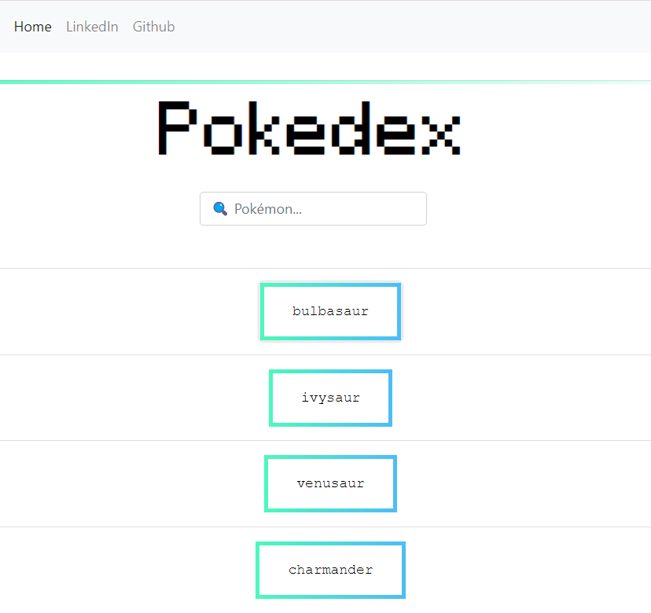
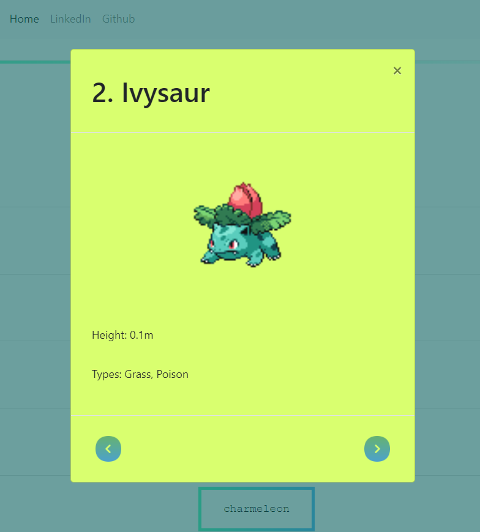

# 📖 basic js app: Pokedex

> This Pokedex project is a simple JavaScript app built using HTML, CSS, and JavaScript. It fetches some detailed data from an external API to display information about the different Pokemons showcasted on this website.

**Link to Pokedex App:** https://louloulinck.github.io/basic-JS-app/

## 🛠 Built With

### Tech Stack

  
Client

  <ul>
    <li><a>Vanilla JS</a></li>
    <li><a>HTML</a></li>
    <li><a>CSS</a></li>
  </ul>

  
Server

  <ul>
    <li><a href="https://pokeapi.co/">RESTful Pokémon API</a></li>
  </ul>

  
Libraries

  <ul>
    <li><a href="https://jquery.com/">jQuery</a></li> 
    <li><a href="https://getbootstrap.com/">Bootstrap</a></li>
  </ul>

  
Polyfills

  <ul>
    <li><a href="https://www.npmjs.com/package/promise-polyfill">Promise</a></li> 
    <li><a href="https://github.com/JakeChampion/fetch">Fetch</a></li>
  </ul>

 <!-- Features -->

### Key Features 
 
- **Load data from an external source (API)**
- **View a list of items**
- **On user action (e.g., by clicking on a list item), view details for that item**

### Overview

> The app showcasts a collection of 150 pokemons to browse through fetched from the RESTful Pokémon API: [PokéAPI](https://pokeapi.co/). The pokemons will get highlighted as the user hovers over them and can read more about any one of them thanks to a modal that will open when selecting the desired pokemon.
The information displayed include its:
**Name**
**Height**
**Image**
 

 

### Responsive Layout & Accessibility

The app was tested to suit a wide spectrum of devices and with accessibility in mind.
 
Components incuding the modal and navigation bar are accessible to screen readers.
 
For a clean and usable design Bootstrap was implemented to the app. Thanks to this framework the layout of the library is set with optimal responsivity for a pleasant experience regardless of screen size.

## Credits

[Flavicon](https://www.flaticon.com/free-icons/pokemon) was used for logo 

(<a href="#readme-top">back to top</a>)

